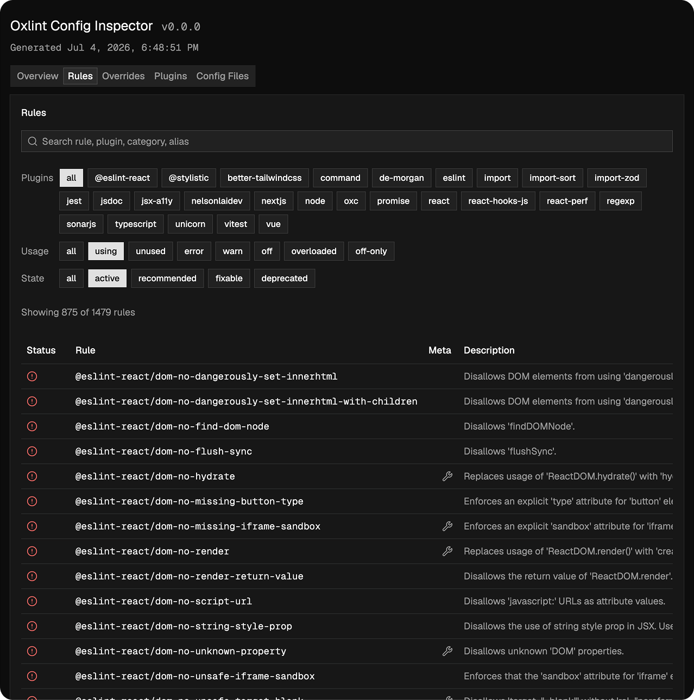
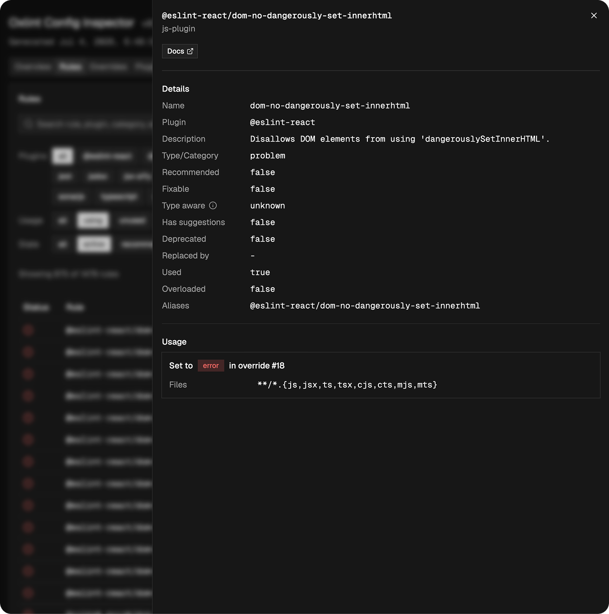

# Oxlint Config Inspector

[](https://www.npmjs.com/package/oxlint-config-inspector)
[](https://www.npmjs.com/package/oxlint-config-inspector)
[](https://github.com/nelsonlaidev/oxlint-config-inspector/blob/main/LICENSE)
[](https://tegami.fuma-nama.dev)

Inspect, browse, and debug your Oxlint configuration.

Oxlint Config Inspector loads an Oxlint config, resolves supported `extends`
chains, discovers builtin and JavaScript plugin rules, and renders the result as
JSON or an interactive web UI.




## Quick Start

```sh
npx oxlint-config-inspector dev
```

Or install globally:

```sh
npm install -g oxlint-config-inspector
```

## CLI Usage

Inspect the nearest Oxlint config and print JSON:

```sh
oxlint-config-inspector inspect
```

Inspect a specific config file:

```sh
oxlint-config-inspector inspect --config oxlint.config.ts
```

Write the inspection result to a file:

```sh
oxlint-config-inspector inspect --output inspect.json
```

Start the interactive inspector:

```sh
oxlint-config-inspector dev
```

Build a static inspector site:

```sh
oxlint-config-inspector build --out-dir dist/oxlint-config-inspector
```

## Programmatic Usage

```ts
import { inspectConfig } from '@oxlint-config-inspector/core'

const result = await inspectConfig({
  cwd: process.cwd(),
})

if (!result) {
  throw new Error('No Oxlint config found')
}

console.log(result.rules)
```

## Requirements

- Node.js 22 or newer.
- The `oxlint` binary should be available on `PATH` when you want builtin rule metadata. If it is missing, the inspector still runs, but builtin rules cannot be cataloged and an error is logged.

## Limitations

- Oxlint does not currently expose any API to retrieve rule descriptions for built-in plugins. The only alternatives are scraping the docs site or parsing the Rust source, neither of which is feasible. Builtin rules will therefore appear without descriptions.

## Packages

| Package                         | Purpose                                                     |
| ------------------------------- | ----------------------------------------------------------- |
| `oxlint-config-inspector`       | CLI for inspecting configs and serving/building the web UI. |
| `@oxlint-config-inspector/core` | Programmatic config loading and inspection utilities.       |
| `@oxlint-config-inspector/app`  | Private React/Vite app bundled into the CLI.                |

## Development

This repository is a pnpm monorepo managed by Turborepo.

```sh
pnpm install
pnpm test
pnpm typecheck
pnpm lint
pnpm format:check
pnpm build
```

The app reads `packages/app/public/data.json` during standalone Vite
development. Generate it first:

```sh
pnpm build --filter=oxlint-config-inspector
node packages/cli/bin/oxlint-config-inspector.mjs inspect --output packages/app/public/data.json
pnpm dev
```

## License

[MIT](./LICENSE)
